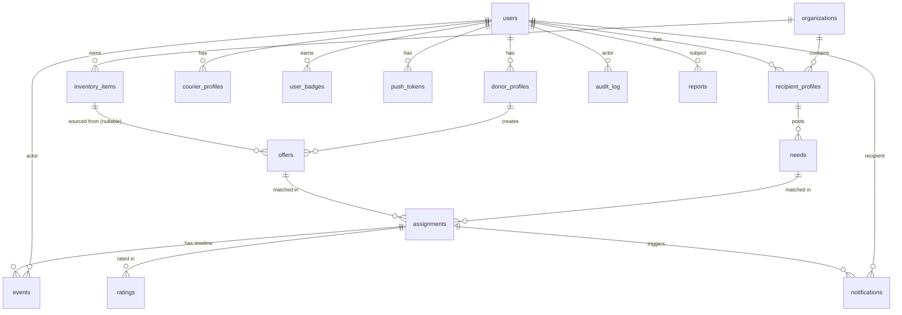

# Time4Giving — ARCHITECTURE (אפיון מערכת)

> מסמך טכני. מגדיר את מבנה המערכת כך שאפשר להתחיל פיתוח **בלי לקבל החלטות תוך כדי הדרך**.
> מסמך אחות: [אפיון-מלא.md](אפיון-מלא.md) (אפיון מוצר).

**גרסה:** 1.1 (שתי זרימות מקבילות + תפקיד רכז)
**Stack נעול:** Expo (React Native) + Supabase (Postgres 15 / PostGIS / Auth / Storage / Realtime / Edge Functions)

---

## 0. עקרונות ארכיטקטוניים

1. **זו מערכת Logistics, לא Marketplace.** הלב הוא **Matching Engine** (§8). כל השאר הוא ממשק סביבו.
2. **Generic Recipient.** "יחידה צבאית" היא ערך אחד ב-`recipient_type`. הליבה אגנוסטית לסוג המקבל.
3. **Event-Sourced.** מקור האמת לתהליך הוא **טבלת events** (§6), לא רק עמודת `status`. ה-status הוא projection.
4. **Append-only ל-audit.** כל פעולה רגישה נכתבת ל-`audit_log` (§6.2). לא נמחק — **Soft Delete** בלבד (§0.6).
5. **Privacy by design.** יעד מדויק לעולם לא במסד. אזור = enum מבוקר. אכיפה בקוד ובסכימה, לא באזהרות (§16).
6. **Soft delete בכל מקום.** כל טבלה עסקית: `deleted_at`, `deleted_by`. אין `DELETE` פיזי מלבד ניקוי GDPR מתוזמן.
7. **הכל דרך RLS + RPC.** הלקוח לא נוגע ישירות בנתונים רגישים; עובר דרך Postgres functions עם בדיקת הרשאה (§11–12).
8. **Enums אמיתיים ב-Postgres** (§4), לא מחרוזות חופשיות.

---

## 1. Tech Stack

| רכיב | טכנולוגיה |
|------|-----------|
| Mobile | Expo (React Native) + expo-router + TypeScript |
| State/Data | TanStack Query + Supabase JS client |
| DB | Supabase Postgres 15 + **PostGIS** |
| Auth | Supabase Auth — Phone OTP |
| Storage | Supabase Storage (תמונות פרופיל/מזון) |
| Realtime | Supabase Realtime (פיד, סטטוס שיבוץ, התראות in-app) |
| Server logic | Supabase **Edge Functions** (Deno) + Postgres **RPC** (plpgsql) |
| Jobs | Supabase **pg_cron** + Edge Functions מתוזמנות |
| Push | Expo Notifications (expo-server-sdk) |
| Maps | react-native-maps + expo-location |

---

## 2. מבנה פרויקט Expo

```
time4giving/
├─ app/                          # expo-router (file-based routing)
│  ├─ (auth)/
│  │  ├─ phone.tsx               # הזנת טלפון
│  │  ├─ otp.tsx                 # אימות OTP
│  │  └─ profile-setup.tsx       # שם, תמונה, תפקיד, אזורים
│  ├─ (tabs)/
│  │  ├─ feed.tsx                # מסך בית קהילתי
│  │  ├─ offers.tsx              # הצעות (לפי תפקיד)
│  │  ├─ needs.tsx               # צרכים
│  │  ├─ my-activity.tsx         # השיבוצים/המשלוחים שלי
│  │  └─ profile.tsx             # כרטיס משתמש
│  ├─ offer/[id].tsx
│  ├─ need/[id].tsx
│  ├─ assignment/[id].tsx        # timeline + חשיפת טלפון
│  └─ admin/                     # תור אישורים, dashboard (web-first)
├─ src/
│  ├─ lib/
│  │  ├─ supabase.ts             # client
│  │  ├─ rpc.ts                  # wrappers ל-RPC (typed)
│  │  └─ regions.ts              # enum האזורים + קיבוץ ל-UI
│  ├─ features/
│  │  ├─ offers/                 # hooks, components, types
│  │  ├─ needs/
│  │  ├─ matching/               # תצוגת התאמות
│  │  ├─ assignments/
│  │  ├─ reputation/             # level, badges, stats card
│  │  ├─ feed/
│  │  └─ notifications/
│  ├─ components/                # UI משותף (RTL-first)
│  └─ types/                     # types מחוללים מ-Supabase (supabase gen types)
├─ supabase/
│  ├─ migrations/                # SQL migrations (source of truth ל-schema)
│  ├─ functions/                 # Edge Functions
│  │  ├─ match-engine/
│  │  ├─ send-notification/
│  │  ├─ scrub-location/         # סינון קואורדינטות/בסיסים בטקסט חופשי
│  │  └─ aggregate-kpis/
│  └─ seed.sql
└─ app.config.ts
```

---

## 3. מודל נתונים — ERD



**זרימת הליבה:**
```
(Inventory) → Offer  ┐
                     ├── Matching Engine → Assignment → [events…] → Confirmed → Rated → Closed
             Need    ┘
```

---

## 4. Enums (Postgres native)

```sql
-- אזורים (מפתח ההתאמה)
CREATE TYPE region AS ENUM (
  'otef','beer_sheva_negev_north','negev_south','arava_dead_sea',
  'carmel_haifa','galil_west','galil_upper','golan',
  'sharon','gush_dan','jerusalem_hills','judea_samaria','jordan_valley'
);

-- coordinator = רכז (מנהל שינוע); courier = משנע מתנדב (משובץ ע"י רכז)
CREATE TYPE user_role        AS ENUM ('donor','recipient','coordinator','courier','org_member','admin');
CREATE TYPE verification_st  AS ENUM ('pending','approved','rejected');
CREATE TYPE recipient_type   AS ENUM ('military_unit','hospital','elderly','family','ngo','rescue','evacuee','emergency');

-- מכונת המצבים של Assignment (§7) — משותפת לשתי הזרימות
CREATE TYPE assignment_status AS ENUM (
  'committed',          -- תורם התחייב ל-Need / מקבל בחר Offer
  'waiting_courier',    -- זקוק לשינוע (self_transport=false), הרכזים קיבלו התראה
  'courier_assigned',   -- הרכז שיבץ משנע
  'picked_up','on_the_way','delivered','confirmed','rated','closed','cancelled'
);

-- זרימה A: תורם מתחייב ל-Need.  זרימה B: תורם מפרסם Offer מוכן למפה.
CREATE TYPE offer_status AS ENUM ('open','claimed','fulfilled','expired','cancelled');
CREATE TYPE need_status  AS ENUM ('open','committed','fulfilled','expired','cancelled');

-- סוגי אירועים (event sourcing §6)
CREATE TYPE event_type AS ENUM (
  'need_created','offer_published','offer_claimed','committed',
  'match_suggested','transport_requested','courier_assigned',
  'picked_up','on_the_way','delivered','confirmed','rated','cancelled','expired'
);

CREATE TYPE notification_channel AS ENUM ('push','in_app');
CREATE TYPE reputation_level     AS ENUM ('verified','trusted','elite','community_leader','national_volunteer');
```

---

## 5. טבלאות (schema מפורט)

> כל הטבלאות העסקיות כוללות `created_at timestamptz default now()`, `deleted_at timestamptz`, `deleted_by uuid`.

```sql
-- ── משתמשים ופרופילים ─────────────────────────────
CREATE TABLE users (
  id uuid PRIMARY KEY REFERENCES auth.users(id),
  phone text UNIQUE NOT NULL,        -- מאומת ע"י Supabase Auth
  full_name text NOT NULL,
  photo_url text,
  roles user_role[] NOT NULL DEFAULT '{donor}',
  verification_status verification_st NOT NULL DEFAULT 'pending',
  reputation_level reputation_level NOT NULL DEFAULT 'verified',
  rating_avg numeric(3,2) DEFAULT 0,
  rating_count int DEFAULT 0,
  -- מדדי מוניטין מצטברים (מתוחזקים ע"י trigger/job):
  total_donations int DEFAULT 0,
  total_units int DEFAULT 0,          -- כריכים/מנות
  total_deliveries int DEFAULT 0,
  units_served int DEFAULT 0,          -- כמה יחידות/מקבלים שירת
  created_at timestamptz DEFAULT now(),
  deleted_at timestamptz, deleted_by uuid
);

CREATE TABLE donor_profiles (
  user_id uuid PRIMARY KEY REFERENCES users(id),
  service_regions region[] NOT NULL DEFAULT '{}',  -- אזורים קבועים (להתראות)
  capabilities text[]                              -- מה יכול להכין (tags)
);

CREATE TABLE courier_profiles (
  user_id uuid PRIMARY KEY REFERENCES users(id),
  service_regions region[] NOT NULL DEFAULT '{}',
  vehicle text
);

CREATE TABLE organizations (
  id uuid PRIMARY KEY DEFAULT gen_random_uuid(),
  name text NOT NULL, logo_url text,
  region region,
  verification_status verification_st NOT NULL DEFAULT 'pending',
  created_at timestamptz DEFAULT now(), deleted_at timestamptz, deleted_by uuid
);

CREATE TABLE recipient_profiles (
  id uuid PRIMARY KEY DEFAULT gen_random_uuid(),
  user_id uuid REFERENCES users(id),
  recipient_type recipient_type NOT NULL,
  org_id uuid REFERENCES organizations(id),
  region region NOT NULL,               -- אזור בלבד. אין geo, אין נקודה.
  display_name text,                    -- לפומבי: גנרי ("יחידה, עוטף")
  created_at timestamptz DEFAULT now(), deleted_at timestamptz, deleted_by uuid
);

-- ── מלאי (ממודל עכשיו, UI בהמשך) ──────────────────
CREATE TABLE inventory_items (
  id uuid PRIMARY KEY DEFAULT gen_random_uuid(),
  org_id uuid REFERENCES organizations(id),
  item_type text NOT NULL,              -- "מים", "כריכים"...
  quantity int NOT NULL,
  unit_label text,
  created_at timestamptz DEFAULT now(), deleted_at timestamptz, deleted_by uuid
);

-- ── ליבה: Offer / Need / Assignment ───────────────
CREATE TABLE offers (
  id uuid PRIMARY KEY DEFAULT gen_random_uuid(),
  donor_id uuid NOT NULL REFERENCES users(id),
  inventory_item_id uuid REFERENCES inventory_items(id),  -- nullable: Offer יכול לנבוע ממלאי
  food_type text NOT NULL,
  quantity int NOT NULL, unit_label text,
  kosher boolean DEFAULT false, vegetarian boolean DEFAULT false,
  notes text,                           -- עובר scrub-location
  photo_url text,
  origin_city text, origin_geo geography(Point,4326),  -- מוצא בלבד (בית התורם)
  service_regions region[] NOT NULL,    -- לאן התורם יכול להגיע
  ready_at timestamptz,
  donor_is_courier boolean DEFAULT false,
  status offer_status NOT NULL DEFAULT 'draft',
  expires_at timestamptz,
  created_at timestamptz DEFAULT now(), deleted_at timestamptz, deleted_by uuid
);

CREATE TABLE needs (
  id uuid PRIMARY KEY DEFAULT gen_random_uuid(),
  recipient_id uuid NOT NULL REFERENCES recipient_profiles(id),
  region region NOT NULL,               -- אזור בלבד (Dropdown)
  quantity int NOT NULL, unit_label text,
  needed_at timestamptz, notes text,    -- notes עובר scrub-location
  status need_status NOT NULL DEFAULT 'open',
  expires_at timestamptz,
  created_at timestamptz DEFAULT now(), deleted_at timestamptz, deleted_by uuid
);

CREATE TABLE assignments (
  id uuid PRIMARY KEY DEFAULT gen_random_uuid(),
  need_id uuid REFERENCES needs(id),      -- זרימה A: התורם התחייב ל-Need
  offer_id uuid REFERENCES offers(id),    -- זרימה B: המקבל בחר Offer מהמפה
  donor_id uuid NOT NULL REFERENCES users(id),      -- התורם שהתחייב
  recipient_id uuid NOT NULL REFERENCES recipient_profiles(id),
  self_transport boolean NOT NULL DEFAULT false,    -- התורם מוביל בעצמו?
  coordinator_id uuid REFERENCES users(id),         -- הרכז ששיבץ שינוע
  courier_id uuid REFERENCES users(id),             -- המשנע המתנדב ששובץ
  org_id uuid REFERENCES organizations(id),
  general_destination region NOT NULL,   -- אזור בלבד
  status assignment_status NOT NULL DEFAULT 'committed',
  phone_revealed_at timestamptz,
  created_at timestamptz DEFAULT now(), deleted_at timestamptz, deleted_by uuid,
  CHECK (need_id IS NOT NULL OR offer_id IS NOT NULL)
);

-- ── מוניטין / דירוג / badges ──────────────────────
CREATE TABLE ratings (
  id uuid PRIMARY KEY DEFAULT gen_random_uuid(),
  assignment_id uuid NOT NULL REFERENCES assignments(id),
  rater_id uuid NOT NULL REFERENCES users(id),
  ratee_id uuid NOT NULL REFERENCES users(id),
  score int NOT NULL CHECK (score BETWEEN 1 AND 5),
  comment text,
  created_at timestamptz DEFAULT now(),
  UNIQUE (assignment_id, rater_id)
);

CREATE TABLE user_badges (
  id uuid PRIMARY KEY DEFAULT gen_random_uuid(),
  user_id uuid NOT NULL REFERENCES users(id),
  badge_type text NOT NULL,
  awarded_at timestamptz DEFAULT now(),
  UNIQUE (user_id, badge_type)
);

-- ── Event Sourcing / Audit / Notifications / Feed ─
CREATE TABLE events (                    -- מקור אמת לתהליך
  id bigint GENERATED ALWAYS AS IDENTITY PRIMARY KEY,
  assignment_id uuid REFERENCES assignments(id),
  offer_id uuid REFERENCES offers(id),
  need_id uuid REFERENCES needs(id),
  type event_type NOT NULL,
  actor_id uuid REFERENCES users(id),
  payload jsonb DEFAULT '{}',
  created_at timestamptz DEFAULT now()
);

CREATE TABLE audit_log (                  -- append-only, פעולות רגישות
  id bigint GENERATED ALWAYS AS IDENTITY PRIMARY KEY,
  actor_id uuid REFERENCES users(id),
  action text NOT NULL,                   -- 'approve_user','reject','delete','block'...
  target_type text, target_id uuid,
  reason text, metadata jsonb,
  created_at timestamptz DEFAULT now()
);

CREATE TABLE notifications (
  id uuid PRIMARY KEY DEFAULT gen_random_uuid(),
  user_id uuid NOT NULL REFERENCES users(id),
  channel notification_channel NOT NULL,
  title text, body text, data jsonb,
  read_at timestamptz,                    -- ל-in-app
  created_at timestamptz DEFAULT now()
);

CREATE TABLE push_tokens (
  user_id uuid REFERENCES users(id),
  token text, platform text,
  PRIMARY KEY (user_id, token)
);

CREATE TABLE feed_events (
  id bigint GENERATED ALWAYS AS IDENTITY PRIMARY KEY,
  type text NOT NULL,                     -- 'donation','daily_summary'...
  actor_id uuid REFERENCES users(id),     -- nullable/anonymized
  payload jsonb,                          -- אנונימי במקום רגיש
  created_at timestamptz DEFAULT now()
);

CREATE TABLE reports (
  id uuid PRIMARY KEY DEFAULT gen_random_uuid(),
  reporter_id uuid REFERENCES users(id),
  target_type text, target_id uuid,
  reason text, status text DEFAULT 'open',
  created_at timestamptz DEFAULT now()
);
```

**אינדקסים מרכזיים:**
```sql
CREATE INDEX ON offers USING gin (service_regions);
CREATE INDEX ON needs (region) WHERE status = 'open';
CREATE INDEX ON offers (status) WHERE status = 'open';
CREATE INDEX ON events (assignment_id, created_at);
CREATE INDEX ON notifications (user_id, read_at);
CREATE INDEX ON offers USING gist (origin_geo);
```

---

## 6. Event Sourcing + Audit + Soft Delete

### 6.1 Events (מקור האמת לתהליך)
- כל מעבר מצב כותב שורה ל-`events` **בתוך אותה טרנזקציה** של עדכון ה-`status`.
- ה-`status` בטבלה = projection לצורך שאילתות מהירות; ה-timeline נבנה מ-`events`.
- שימושים: Timeline למשתמש, Debug, מקור ל-Notifications, בסיס ל-KPIs (§15).

### 6.2 Audit Log
- כל פעולת אדמין/רגישה: `approve_user`, `reject`, `block`, `delete`, `reveal_phone`.
- Append-only. גישה: אדמין בלבד.

### 6.3 Soft Delete
- אין `DELETE` פיזי. `deleted_at`+`deleted_by`.
- כל ה-RLS וה-Views מסננים `WHERE deleted_at IS NULL`.
- Job GDPR מתוזמן מוחק פיזית לפי מדיניות שמירה (§13).

---

## 7. State Machine (Assignment)

```mermaid
stateDiagram-v2
    [*] --> committed: donor commits to Need (A) / recipient claims Offer (B)
    committed --> picked_up: self_transport = true
    committed --> waiting_courier: self_transport = false → coordinators notified
    waiting_courier --> courier_assigned: coordinator assigns volunteer courier
    waiting_courier --> picked_up: coordinator marks "donor self-transports"
    courier_assigned --> picked_up
    picked_up --> on_the_way
    on_the_way --> delivered
    delivered --> confirmed: recipient confirms
    confirmed --> rated
    rated --> closed
    committed --> cancelled
    waiting_courier --> cancelled
    courier_assigned --> cancelled
```



**מי מבצע כל מעבר (permissions):**
| מעבר | מבצע |
|------|------|
| → committed | תורם (מתחייב ל-Need) / מקבל (בוחר Offer) |
| → waiting_courier | אוטומטי כש-`self_transport=false` |
| → courier_assigned / picked_up (dispatch) | **רכז** |
| picked_up → on_the_way → delivered | משנע (או תורם אם self_transport) |
| delivered → confirmed | מקבל |
| → rated | שני הצדדים |

**מעברים חוקיים נאכפים ב-RPC** (`advance_assignment(id, event_type)`), לא בלקוח. כל מעבר:
1. בודק הרשאה (מי רשאי לבצע את המעבר הזה — לפי הטבלה למעלה).
2. בודק שהמעבר חוקי מהמצב הנוכחי.
3. מעדכן `status` + כותב `events` + יוצר `notifications` — טרנזקציה אחת.

---

## 8. Matching Engine (המודול המרכזי)

מודול נפרד (Edge Function `match-engine` + RPC). שלושה טריגרים:

1. **Need נוצר (זרימה A):** fan-out — מזהה את כל התורמים ש-`service_regions` שלהם כולל את `need.region`, מדרג אותם (reputation/זמינות), ושולח **Push**. זה הליבה של "כל בקשה מגיעה מיד לתורמים הרלוונטיים".
2. **Offer נוצר (זרימה B):** נכנס למאגר המפה. מקבלים שואלים אותו לפי region/קרבה (query, לא push).
3. **דרוש שינוע:** כשמסומן `self_transport=false` — מדרג **משנעים מתנדבים** באזור עבור הרכז (candidate list ל-dispatch).

```
INPUTS                          LOGIC                         OUTPUT
─────────                       ─────                         ──────
Need / Offer / transport-req    1. region overlap (filter)    → Need:  ranked donors → Push
Region(s)                       2. quantity fit               → Offer: map results (query)
Quantity + unit                 3. time window fit            → transport: ranked couriers
Time window                     4. reputation / availability     (candidate list לרכז)
Reputation level                5. scoring (ranking)
```

**Scoring (v1 — דטרמיניסטי, ללא AI):**
```
score =  region_match         (חובה — filter, לא score)
       + quantity_fit    * w1  (כמה קרוב הכמות לצורך)
       + time_fit        * w2  (חפיפת חלון זמן)
       + reputation      * w3  (Level של התורם/משנע)
       + freshness       * w4  (כמה חדש ה-Need/Offer)
       - distance_penalty      (אם יש origin_geo — משני)
```

**עקרונות מודולריות:**
- ה-Engine מקבל **DTO של inputs** ומחזיר **ranked matches** — ללא side-effects. יצירת ה-Assignment היא צעד נפרד (`create_assignment`).
- ממשק יציב → בעתיד אפשר להחליף את הליבה ב-**AI ranking** (LLM/embedding) בלי לגעת בשאר המערכת.
- מלאי: Offer שנובע מ-`inventory_item` — ה-Engine בודק זמינות מול המלאי לפני הצעה.

**API של המודול:**
```ts
type MatchInput = {
  kind: 'offer' | 'need';
  entityId: string;
  regions: Region[];
  quantity: number; unitLabel: string;
  timeWindow?: { from: string; to: string };
};
type SuggestedMatch = {
  offerId?: string; needId?: string;
  score: number; reasons: string[];
};
matchEngine(input: MatchInput): Promise<SuggestedMatch[]>
```

---

## 9. זרימות הליבה → Assignment

```
זרימה A (Need-first):
  recipient → create_need ─► fan-out Push ─► donor commit_to_need ─┐
                                                                    ▼
זרימה B (Offer-first):                                         Assignment
  donor → publish_offer ─► map ─► recipient claim_offer ─────────►  │
                                                                    │
  self_transport=false ─► Push לרכזים ─► assign_courier            │
                                                                    ▼
              advance_assignment × workflow (§7) ─► confirmed ─► rated ─► closed
                                                        │
                                                        ▼
              מעדכן units_served, total_units, מזין feed_events
```

**מלאי (עתידי, ממודל):** עמותה תוכל ליצור Offer מתוך `inventory_items` (`offers.inventory_item_id`, מנכה מהמלאי). ב-MVP אין UI למלאי — הטבלה קיימת, השדה null בפועל. כשעמותות ייכנסו — מוסיפים UI בלבד, בלי שינוי סכימה.

---

## 10. Notifications (Push + In-App)

- **טבלת `notifications` היא מקור האמת** — לא רק Push חד-פעמי.
- כל event רלוונטי → כותב שורת `notifications` (channel = in_app) → המשתמש רואה **היסטוריה**.
- במקביל, Edge Function `send-notification` שולפת `push_tokens` ושולחת **Push** דרך Expo.
- Realtime subscription על `notifications` → badge/מסך התראות מתעדכן חי.

**אירועים מזמני התראה:**
- **לתורם:** בקשה חדשה באזורך · תרומה מוכנה חדשה על המפה
- **לרכז:** תרומה זקוקה לשינוע באזור X
- **למקבל:** תורם התחייב לבקשתך · אושרה קבלה
- **למשנע:** שובצת למשלוח
- **מעברי סטטוס:** יצא/בדרך · נמסר · דורגת
- **גיימיפיקיישן:** עלית Level · תג חדש

---

## 11. API Design (RPC + Edge Functions)

הלקוח **לא** עושה `INSERT/UPDATE` ישיר על טבלאות רגישות. הכל דרך פונקציות עם בדיקת הרשאה:

| פונקציה | סוג | תיאור |
|---------|-----|-------|
| `create_need(payload)` | RPC | **זרימה A:** יוצר Need (region בלבד) + scrub → מפעיל fan-out Push לתורמים באזור |
| `commit_to_need(need_id, self_transport, details)` | RPC | תורם מתחייב → יוצר Assignment (`committed`). אם `self_transport=false` → מסמן `waiting_courier` + Push לרכזים |
| `publish_offer(payload)` | RPC | **זרימה B:** תורם מפרסם תרומה מוכנה (origin_geo למפה) + scrub |
| `claim_offer(offer_id, need_transport)` | RPC | מקבל בוחר Offer מהמפה → Assignment. `need_transport=true` → Push לרכזים |
| `map_offers(bbox/region)` | RPC | שאילתת תרומות זמינות למפה (query זרימה B) |
| `assign_courier(assignment_id, courier_id)` | RPC | **רכז** משבץ משנע → `courier_assigned` + Push למשנע |
| `advance_assignment(id, event)` | RPC | מעבר מצב חוקי (§7) + event + notifications |
| `reveal_phone(assignment_id)` | RPC | מחזיר טלפון **רק** אם שיבוץ פעיל + הצד מורשה + audit |
| `submit_rating(assignment_id, score, comment)` | RPC | דירוג אחרי confirmed בלבד |
| `admin_approve_user(user_id)` | RPC | אדמין בלבד + audit_log |
| `admin_dashboard_kpis()` | RPC | מחזיר KPIs (§15) |
| `match-engine` | Edge Fn | fan-out/דירוג (§8) |
| `send-notification` | Edge Fn | push |
| `scrub-location` | Edge Fn | סינון קואורדינטות/בסיסים בטקסט |
| `aggregate-kpis` | Edge Fn (cron) | חישוב KPIs תקופתי |

---

## 12. מודל הרשאות + RLS

### תפקידים
`donor` · `courier` · `recipient` · `org_member` · `admin` (ב-`users.roles[]`). בדיקה עוזרת:
```sql
CREATE FUNCTION has_role(r user_role) RETURNS boolean AS $$
  SELECT r = ANY ((SELECT roles FROM users WHERE id = auth.uid()));
$$ LANGUAGE sql STABLE;
```

### RLS (דוגמאות)
```sql
ALTER TABLE offers ENABLE ROW LEVEL SECURITY;

-- קריאה: מאומתים בלבד, לא-מחוק
CREATE POLICY offers_read ON offers FOR SELECT
  USING (deleted_at IS NULL AND auth.role() = 'authenticated');

-- כתיבה/עדכון: הבעלים בלבד
CREATE POLICY offers_write ON offers FOR ALL
  USING (donor_id = auth.uid()) WITH CHECK (donor_id = auth.uid());

-- assignments: רק הצדדים המשובצים או אדמין
CREATE POLICY assignments_read ON assignments FOR SELECT USING (
  deleted_at IS NULL AND (
    recipient_id IN (SELECT id FROM recipient_profiles WHERE user_id = auth.uid())
    OR courier_id = auth.uid()
    OR offer_id IN (SELECT id FROM offers WHERE donor_id = auth.uid())
    OR has_role('admin')
  )
);

-- audit_log: אדמין בלבד
CREATE POLICY audit_admin ON audit_log FOR SELECT USING (has_role('admin'));
```

### חשיפת טלפון
- **אין** עמודת טלפון ב-SELECT רגיל. הטלפון נגיש **רק** דרך `reveal_phone(assignment_id)` שבודק: השיבוץ פעיל + הקורא הוא צד רלוונטי → מחזיר טלפון + כותב `audit_log(reveal_phone)`.

---

## 13. Jobs / Cron (pg_cron + Edge Functions)

| Job | תדירות | פעולה |
|-----|--------|-------|
| `expire_stale` | כל שעה | Offers/Needs שעברו `expires_at` → status=expired + event |
| `aggregate-kpis` | כל לילה | חישוב KPIs (§15) לטבלת cache |
| `award-badges` | כל לילה | בדיקת ספי badges/Level + עדכון |
| `hide-old-contacts` | יומי | הסתרת טלפונים X ימים אחרי confirmed |
| `gdpr-purge` | שבועי | מחיקה פיזית של רשומות soft-deleted מעבר לתקופת שמירה |
| `daily-feed-summary` | יומי | יצירת `feed_events` מסוג daily_summary (מצרפי, אנונימי) |

---

## 14. Security

1. **RLS על כל טבלה** + כתיבה רגישה דרך RPC בלבד (`SECURITY DEFINER` עם בדיקות פנימיות).
2. **scrub-location** על כל טקסט חופשי (offers.notes, needs.notes): regex לקואורדינטות + blocklist שמות בסיסים → חסימה/מיסוך.
3. **אזור = enum** — בלתי אפשרי להזין מיקום חופשי בסכימה.
4. **Rate limiting** על יצירת Offer/Need/Report (מניעת הצפה).
5. **חשיפת טלפון מבוקרת + מתועדת** (audit).
6. **אנונימיזציה בפומבי:** views ציבוריים (feed, listing) מחזירים `display_name` גנרי, לא זהות מקבל.
7. **Storage policies:** תמונות פרופיל/מזון בלבד, בעלות מאומתת.
8. **Secrets** ב-Supabase Vault / env של Edge Functions, לא בלקוח.

---

## 15. KPIs / Analytics (Admin)

מחושבים מ-`events` (§6.1) ל-cache יומי:

| KPI | חישוב |
|-----|-------|
| Avg Matching Time | `match_suggested` − `offer/need_created` |
| Avg Pickup Time | `picked_up` − `reserved` |
| Avg Delivery Time | `delivered` − `picked_up` |
| Avg Rating | ממוצע `ratings.score` |
| Cancelled % | cancelled / total |
| Expired % | expired / total |
| Volume | Σ תרומות, Σ יחידות (כריכים), משלוחים, מקבלים, ערים/אזורים |
| Heatmap | פעילות לפי `origin` / region (לא יעדים) |

Dashboard (web-first ב-`app/admin/`): מגמות, תור אישורים, דיווחים, חסימות.

---

## 16. אכיפת פרטיות (סיכום טכני)

| כלל | מימוש |
|-----|-------|
| אין מיקום יעד מדויק | אין עמודת `destination_geo`. יעד = `region` enum בלבד |
| אזור בלבד בטפסים | UI: Dropdown enum. אין TextInput למיקום |
| טקסט חופשי נקי | Edge Function `scrub-location` על notes |
| מיקום מקבל בחיפוש לא נשמר | RPC מקבל קואורדינטות מטושטשות כפרמטר, לא שומר |
| טלפון מוגן | `reveal_phone` RPC + audit בלבד |
| זהות מקבל אנונימית | views ציבוריים עם `display_name` גנרי |
| מסירה מדויקת | מחוץ למערכת — טלפון בלבד |

---

## 17. סדר עבודה מומלץ (שלב 0 → MVP)

1. `supabase init` → migrations: enums (§4) → tables (§5) → RLS (§12).
2. Auth OTP + onboarding (שם/תמונה/תפקיד/אזורים).
3. **זרימה A:** `create_need` + scrub-location + fan-out Push לתורמים.
4. `commit_to_need` (self_transport flag) + Assignment.
5. שלב רכז: `assign_courier` + קונסולת dispatch.
6. **זרימה B:** `publish_offer` + `map_offers` + מסך מפה + `claim_offer`.
7. `advance_assignment` (state machine §7) + events + timeline.
8. `reveal_phone` (audit) — חשיפת טלפון אחרי התאמה.
9. ratings + reputation projection + כרטיס עשיר.
10. notifications (in-app + push).
11. feed + badges + jobs (§13).
12. admin: תור אישורים + KPIs dashboard.

---

*מסמך זה מגדיר את "איך". ה"מה" ו"למה" ב-[אפיון-מלא.md](אפיון-מלא.md). שינויי סכימה מתועדים כ-migrations תחת `supabase/migrations/`.*
